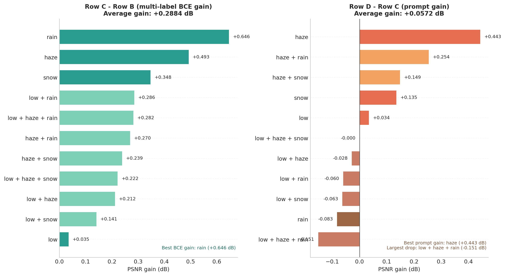
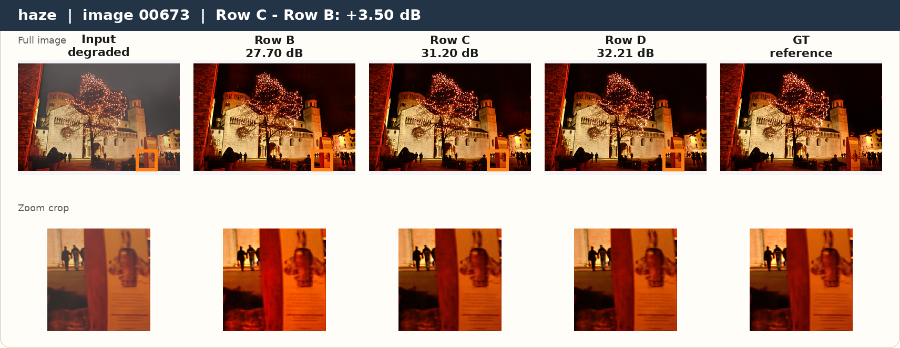
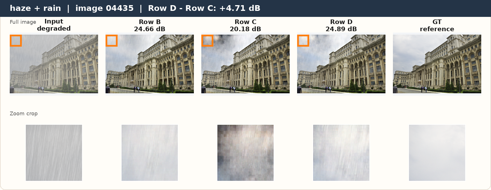
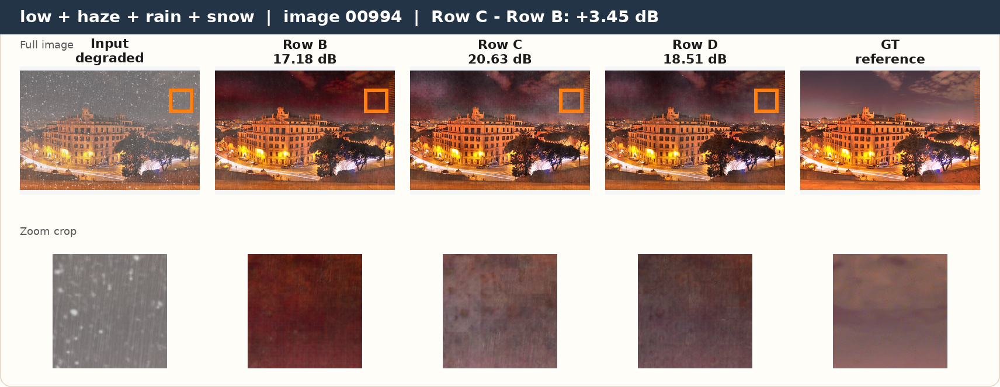

# Weak-Supervision Enhancements to DCPT on CDD-11

This repository contains our course project built on top of the DCPT codebase for mixed-degradation image restoration. We study whether smarter weak supervision can still improve restoration quality under a tight compute budget.

Our work keeps the original DCPT idea of degradation-classification-based pretraining, but adds two practical extensions:

- `Row C`: replace flat 11-class degradation supervision with a 4-dimensional multi-label BCE objective over the primitive degradations `{low-light, haze, rain, snow}`
- `Row D`: inject the pretrained classifier output back into the restoration network as a semantic soft prompt during finetuning

All experiments are run on the `CDD-11` benchmark using `NAFNet` with a reduced schedule of `25k` pretraining iterations and `100k` finetuning iterations.

## Project Summary

The original DCPT paper uses degradation classification as weak supervision for universal image restoration pretraining. We adapt that idea to a constrained project setting and ask:

1. Does primitive-aware multi-label supervision transfer better than a flat 11-way label?
2. Can classifier-guided prompt injection further improve restoration during finetuning?
3. Do these gains persist under reduced compute and on unseen degradation combinations?

### Main Findings

- `Row C` improves over `Row B` on all 11 CDD-11 test settings.
- `Row D` achieves the best average PSNR, but `Row C` retains the best average SSIM.
- On an unseen synthetic 4-way degradation split, `Row C` still performs best on average.

### Average Results on the 11 Standard CDD-11 Settings

| Model | Description | Avg. PSNR | Avg. SSIM |
|---|---|---:|---:|
| Row B | Single-label pretraining + finetuning | 24.4769 | 0.8045 |
| Row C | Multi-label BCE pretraining + finetuning | 24.7653 | 0.8155 |
| Row D | Prompt-based finetuning on top of Row C pretraining | **24.8225** | 0.8136 |

Key interpretation:

- `Row C - Row B = +0.2884 dB / +0.0110 SSIM`
- `Row D - Row C = +0.0572 dB / -0.0019 SSIM`

### Unseen 4-Way Stress Test

We also evaluate on an out-of-distribution synthetic split containing `low + haze + rain + snow`, which none of the models saw during training or standard testing.

| Model | Avg. PSNR | Avg. SSIM |
|---|---:|---:|
| Row B | 17.2459 | 0.5656 |
| Row C | **17.3904** | **0.5763** |
| Row D | 17.2794 | 0.5721 |

This supports the main qualitative conclusion of the project: the multi-label formulation transfers more robustly than the single-label baseline when degradations become more compositional.

## What We Added Compared to the Original DCPT Repository

Compared to the original paper codebase, this repository adds:

- a full `CDD-11` ablation plan for `Row A / B / C / D`
- a custom multi-label BCE pretraining setup for compositional degradations
- a prompt-based finetuning path that consumes the classifier prediction as a soft semantic condition
- experiment runners for stage-wise execution and resume-friendly workflows
- scripts to generate project figures, plots, qualitative cards, and report assets
- an unseen 4-way degradation stress test that extends beyond the standard CDD-11 combinations

## Repository Structure

```text
.
├── basicsr/                      # Core training / testing / model code
├── options/
│   └── cdd_experiments/         # YAML configs for Row B / C / D experiments
├── scripts/                     # Utilities for figure generation and analysis
├── run_experiments.sh           # Main launcher for all experiment stages
├── EXPERIMENTAL_SETUP.md        # Detailed plan, dependencies, and rationale
├── Experiment_Results/          # Final figures, qualitative cards, unseen 4-way assets
├── Model_outputs/               # Saved output images from test-time inference
└── README.md                    # This file
```

### Important Subfolders

- [options/cdd_experiments](./options/cdd_experiments): training and testing configs for all rows
- [Experiment_Results/figures](./Experiment_Results/figures): final report plots such as loss curves and gain plots
- [Experiment_Results/qualitative_cards](./Experiment_Results/qualitative_cards): standalone visual comparisons with zoom crops
- [Experiment_Results/unseen_4way](./Experiment_Results/unseen_4way): synthetic 4-way evaluation assets
- [Model_outputs](./Model_outputs): saved restoration outputs from the tested models

## Visual Results

### Metric Gain Visualization



### Example Qualitative Comparisons

`Row C vs Row B` on a haze-heavy case:



`Row D vs Row C` on a mixed degradation case:



`Unseen 4-way` stress test example:



## Experimental Design

The full motivation and roadmap are documented in [EXPERIMENTAL_SETUP.md](./EXPERIMENTAL_SETUP.md). The experiment rows are:

- `Row A`: released DCPT `NAFNet` checkpoint used as a reference ceiling
- `Row B`: reduced-compute baseline using single-label degradation classification
- `Row C`: replace the pretraining label with a 4D multi-hot target and BCE loss
- `Row D`: keep the Row C pretrained classifier and inject its output as a soft prompt during finetuning

In this cleaned GitHub version, `run_experiments.sh` directly exposes the `Row B / C / D` stages. `Row A` is kept as a reference result from the released DCPT checkpoint rather than as a separate launcher stage.

### Why Multi-Label BCE Helps

In `CDD-11`, each image may contain multiple primitive degradations simultaneously. A flat 11-way label discards that structure. Our `Row C` formulation instead supervises the primitive decomposition directly:

- `low` -> `[1, 0, 0, 0]`
- `low_haze` -> `[1, 1, 0, 0]`
- `low_haze_rain` -> `[1, 1, 1, 0]`

This makes the weak supervision more aligned with the restoration problem, especially for mixed corruption settings.

### Why Prompt Injection Helps

`Row D` reuses the pretrained classifier from `Row C` and feeds its predicted 4D degradation vector back into the restoration network. This gives the restoration backbone an explicit semantic signal instead of forcing it to infer everything implicitly from the image alone.

## Environment Setup

### cn07 Cluster Workflow

This project is designed around `two` Linux virtual environments because cn07 may assign either:

- `RTX A6000` GPUs that need the `cu118` stack
- `RTX PRO 6000 Blackwell` GPUs that need the `cu121` stack

Use the repo's cluster scripts rather than the old single-env conda example:

```bash
srun --partition=phd --nodelist=cn07 --gres=gpu:1 --cpus-per-task=8 --mem=32G --pty bash
bash /csehome/p24cs0203/krish/projects/DL_Project/setup_envs.sh
```

What this does:

- builds `/csehome/p24cs0203/krish/envs/dl_project` for `torch==2.1.2+cu118`
- builds `/csehome/p24cs0203/krish/envs/dl_project_cu121` for `torch==2.3.1+cu121`
- installs the shared repo requirements from [`requirements-cluster.txt`](./requirements-cluster.txt)
- registers the repo with a `.pth` file so `basicsr` imports cleanly
- validates torch, torchvision, imports, dataset paths, and GPU compatibility

To repair existing envs without rebuilding:

```bash
bash /csehome/p24cs0203/krish/projects/DL_Project/install_venv_packages.sh
```

To run the build in a detached SLURM job so it keeps going even if your laptop disconnects:

```bash
sbatch /csehome/p24cs0203/krish/projects/DL_Project/slurm/setup_envs.slurm
```

To resume or repair after a network interruption:

```bash
sbatch /csehome/p24cs0203/krish/projects/DL_Project/slurm/repair_envs.slurm
```

To diagnose both envs interactively:

```bash
bash /csehome/p24cs0203/krish/projects/DL_Project/diagnose_envs.sh
```

Every SLURM job should source [`slurm/_cluster_env.sh`](./slurm/_cluster_env.sh), which auto-detects the assigned GPU and activates the matching venv.

### Local / Non-cluster Note

`environment.yaml` is only a starting point for local development. It is not the source of truth for cn07 because a single conda file cannot represent both CUDA stacks at once.

## Running the Experiments

All main stages are launched through [run_experiments.sh](./run_experiments.sh).

### Row B

Pretraining:

```bash
bash run_experiments.sh row_b_pretrain
```

Finetuning:

```bash
bash run_experiments.sh row_b_finetune
```

Testing:

```bash
bash run_experiments.sh test_row_b --force_yml val:save_img=false
```

### Row C

Pretraining:

```bash
bash run_experiments.sh row_c_pretrain
```

Finetuning:

```bash
bash run_experiments.sh row_c_finetune
```

Testing:

```bash
bash run_experiments.sh test_row_c --force_yml val:save_img=false
```

### Row D

Finetuning:

```bash
bash run_experiments.sh row_d_finetune --force_yml path:strict_load_g=false
```

Testing:

```bash
bash run_experiments.sh test_row_d --force_yml val:save_img=false
```

### Multi-GPU Usage

When running multiple stages in parallel, assign each job:

- a different `CUDA_VISIBLE_DEVICES`
- a different `MASTER_PORT` for `torchrun`-based stages

Example:

```bash
CUDA_VISIBLE_DEVICES=0 MASTER_PORT=29510 bash run_experiments.sh row_b_finetune
CUDA_VISIBLE_DEVICES=1 MASTER_PORT=29511 bash run_experiments.sh row_c_finetune
CUDA_VISIBLE_DEVICES=2 MASTER_PORT=29512 bash run_experiments.sh row_d_finetune --force_yml path:strict_load_g=false
```

## How to Reproduce the Figures and Plots

The repository includes scripts that regenerate the project visuals from experiment logs and saved outputs.

Generate report figures:

```bash
python scripts/generate_report_assets.py
```

Export the report PDF:

```bash
python scripts/export_report_pdf.py
```

Useful generated artifacts include:

- loss curves for pretraining and finetuning
- PSNR gain plots
- grouped metric visualizations
- qualitative image cards with zoom crops

## How to Reproduce Qualitative Comparisons

To select high-gain examples for qualitative analysis:

```bash
python scripts/select_qualitative_examples.py
```

Outputs are stored in:

- [Experiment_Results/qualitative_cards](./Experiment_Results/qualitative_cards)

These cards were selected from actual saved model outputs and highlight cases where:

- `Row C` significantly improves over `Row B`
- `Row D` significantly improves over `Row C`
- `Row D` significantly improves over `Row B`

## Unseen 4-Way Generalization Experiment

We also added an out-of-distribution stress test containing all four primitive degradations at once:

- `low`
- `haze`
- `rain`
- `snow`

This split is generated synthetically because standard `CDD-11` includes combinations up to three degradations.

Generate the synthetic unseen 4-way data:

```bash
python scripts/generate_unseen_fourway_dataset.py
```

Generate unseen-4-way qualitative cards:

```bash
python scripts/export_unseen_fourway_cards.py
```

Relevant assets:

- [Experiment_Results/unseen_4way/fourway_generation_notes.txt](./Experiment_Results/unseen_4way/fourway_generation_notes.txt)
- [Experiment_Results/unseen_4way/cards](./Experiment_Results/unseen_4way/cards)

## Reproducibility Notes

- The repository is cleaned for GitHub submission, so large checkpoints, TensorBoard logs, and raw training artifacts may be excluded.
- The important code, configs, scripts, and final analysis assets are retained.
- If you want the exact training workflow and stage dependencies, refer to [EXPERIMENTAL_SETUP.md](./EXPERIMENTAL_SETUP.md).

## Takeaway

The strongest project conclusion is not just that one more model variant wins a benchmark. It is that the *structure of the weak supervision matters*.

- A primitive-aware multi-label target is more useful than a flat 11-way label on mixed degradations.
- Prompt injection can improve PSNR further, but its benefit is more selective and less stable than the gain from better pretraining supervision.
- These trends remain visible even under a much smaller training budget than the original paper.

## Acknowledgement

This project builds on the original DCPT codebase and paper:

> J. Hu et al., “Degradation Classification Pre-Training for Universal Image Restoration,” ICLR 2025.

We use their repository as the starting point and extend it for our project-specific weak-supervision and prompt-conditioning experiments on `CDD-11`.
